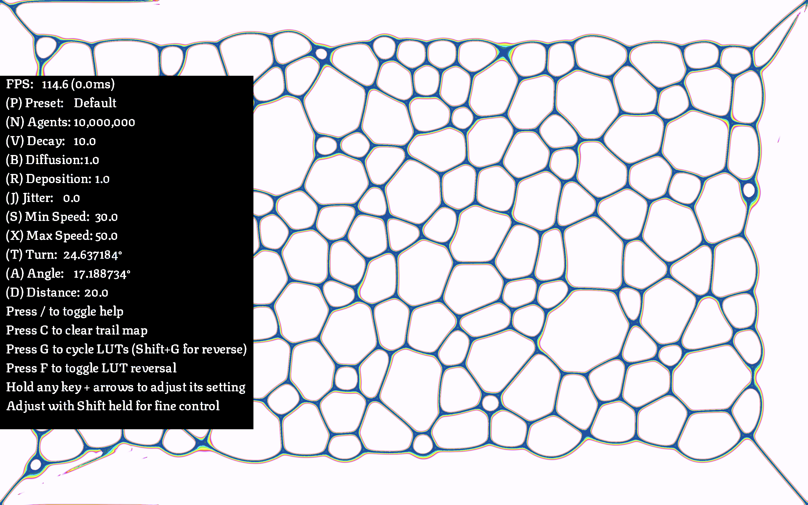

# Slime Mold

A GPU-accelerated slime mold simulation written in Rust using WGPU. This project simulates the emergent behavior of slime mold colonies using compute shaders. It supports millions of agents on modern hardware.




## Features

- Real-time GPU-accelerated simulation using WGPU
- Interactive parameter customization for slime behavior
- Multiple presets for different simulation patterns
- Custom LUT (Look-Up Table) support for color visualization
- Configurable Gaussian blur for trail diffusion

## Quickstart

Run the simulation with `cargo`:

```sh
cargo run --release
```

## Key Bindings

- `P`: Cycle through presets (Shift+P for reverse)
- `N`: Adjust agent count (Shift+N for fine control)
- `V`: Adjust pheromone decay factor (Shift+V for fine control)
- `B`: Adjust pheromone diffusion rate (Shift+B for fine control)
- `R`: Adjust pheromone deposition amount (Shift+R for fine control)
- `J`: Adjust agent jitter (Shift+J for fine control)
- `S`: Adjust minimum agent speed (Shift+S for fine control)
- `X`: Adjust maximum agent speed (Shift+X for fine control)
- `T`: Adjust agent turn speed (Shift+T for fine control)
- `A`: Adjust agent sensor angle (Shift+A for fine control)
- `D`: Adjust agent sensor distance (Shift+D for fine control)
- `G`: Cycle through LUTs (Shift+G for reverse)
- `F`: Toggle LUT reversal
- `C`: Clear trail map
- `/`: Toggle help text
- `Esc`: Exit

## License

This project is open source and available under the MIT License.
